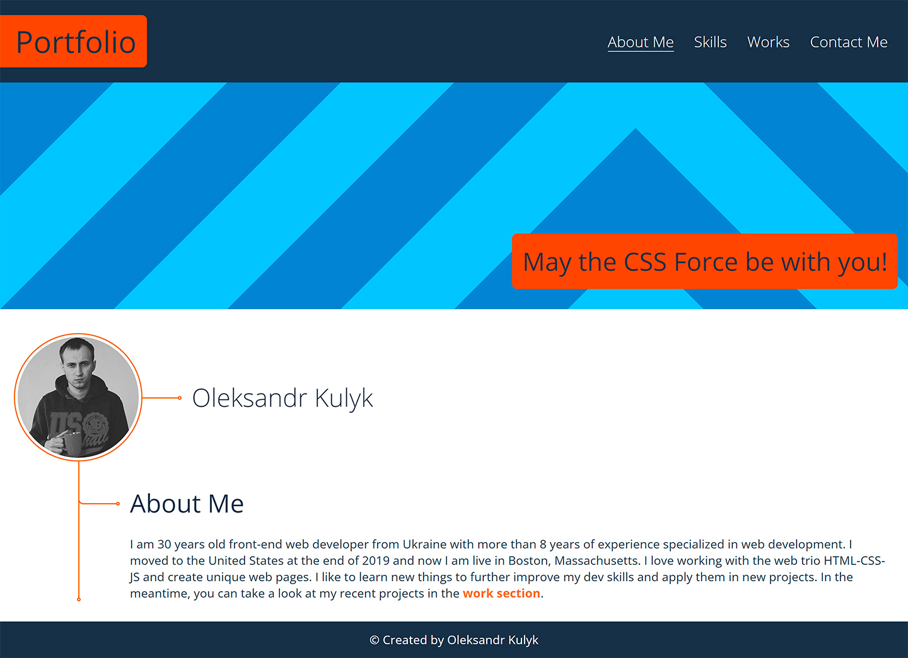
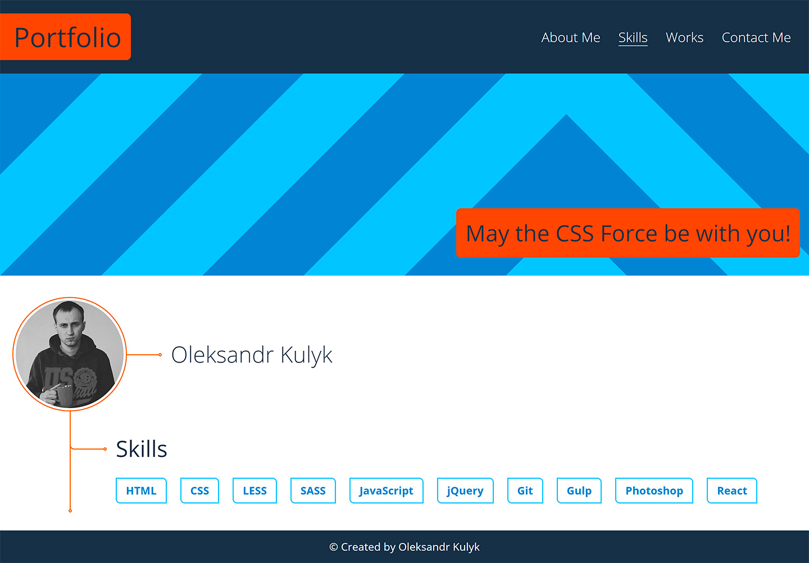
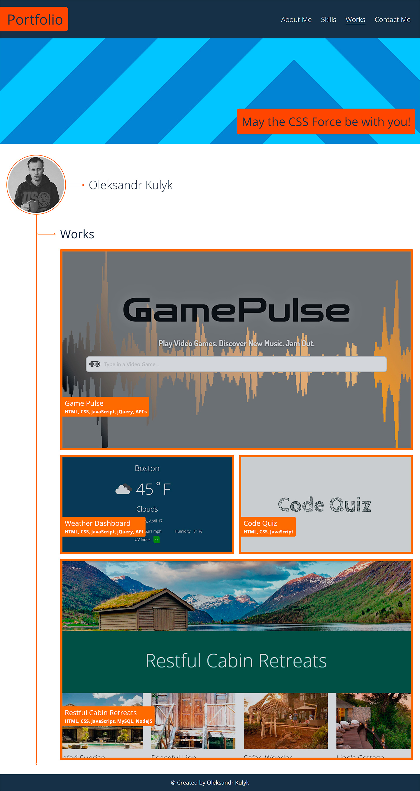
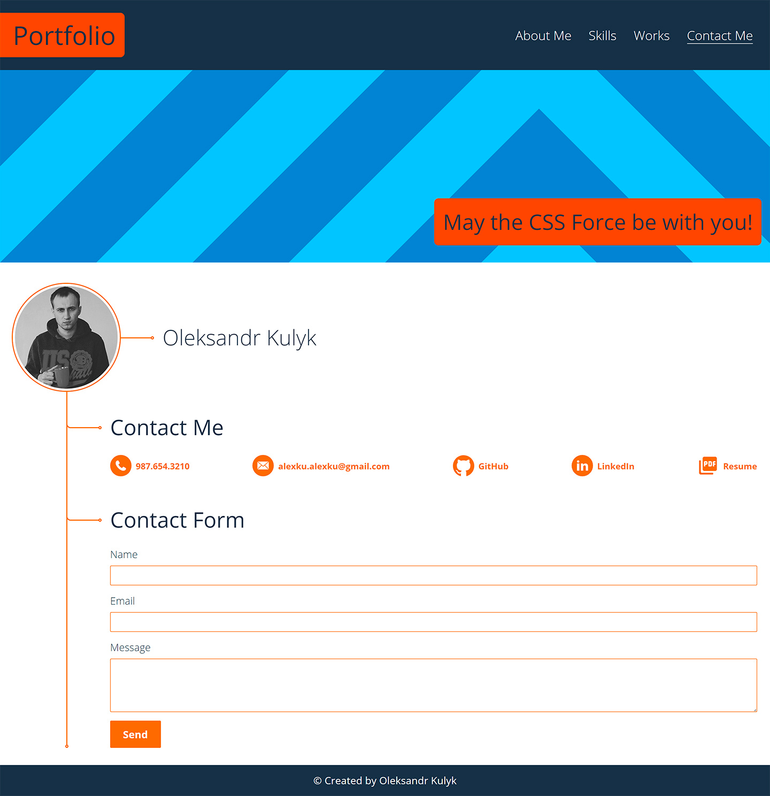

# React Portfolio

**Preview link** - https://alexkuwerz.github.io/unh-react-portfolio/

## Description

Portfolio landing page example includes Header sections with Logo and main menu, Content section, that divided into Hero banner and About Me, Skills, Works, Contact blocks on respective pages, Footer section. Web page is fully responsive on all screen sizes.

## Installation
To be able to run the website localy you need to install the necessary `npm modules`. You can do this by running the command 

```bash
npm install
```

in the root folder of the project.

## Usage
To run website localy use this command from root folder:

```bash
npm start
```

## Previews
About page preview:



About page preview:



Works page preview:



Contact page preview:



## Credits
Author [Oleksandr Kulyk](https://github.com/AlexKuWerz)
